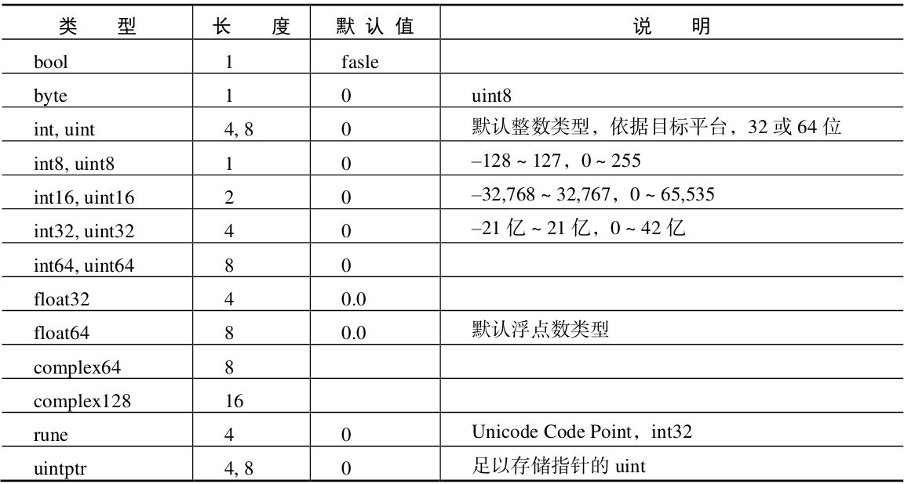

#  Go 基础

## 1 程序结构

### 1.1 基本结构

```go
package main  //以package声明开头，说 明源文件所属的包

import "fmt" //import导入依赖的包，其次为包级别的变量、常量、类型和函数的声明和赋值。

func main()  {
	//函数中可定义局部的变量、常量
	fmt.Println("Hellow Word")
}
```

### 1.2 编译

运行：
`go build -work -x -o helloworld.exe main.go`
`go run -work -x main.go`

## 2 变量

+ 变量是指对一块存储空间定义名称，通过名称对存储空间的内容进行访问或修改，使用var进行变量声明
+ 在函数中声明了变量之后必须要使用；如果在函数外声明变量可以不使用
+ 变量定义后，若没有赋值，变量会有一个零值，不同类型变量零值不同
+ 变量只能声明一次

### 2.1 变量声明

#### 2.1.1 声明变量

```go
	var me string //定义字符串类型的变量me
	me = "fan" //对变量赋值
	fmt.Println(me) //打印变量
```

#### 2.1.2 定义并赋值函数

#### 2.1.2 定义多个相同类型变量并赋值

```go
	var user, name string = "fan", "fan" //定义多个相同类型的变量
	fmt.Println(user, name )
```

#### 2.1.3 定义多个不同类型变量并赋值

**方法一：**

```go
	var (
		//定义多个不同类型变量并赋值
		age int = 20
		height float32 = 1.64
	)
```

**方法二：**

```go
	var ss, aa = "haha", 33 
```

#### 2.1.4 简短声明

+ 简短声明只能在函数内使用
+ 简短声明可以同时声明多个变量

```go
	isBoy := true //简短声明，使用时可以省略变量类型，go会推到函数类型，只能在函数内使用
	fmt.Println(isBoy)
```

#### 2.1.5 赋值

+ 可以通过赋值交换变量的值

```go
	b, bb := "b", "bb"
	b, bb =  bb, b //对变量重新赋值（讲话两个变量的值）
	fmt.Println(b, bb)
```

## 3 常量

+ 用于定义不可被修改的的值，需要在编译过程中进行计算，只能为基础的数据类型布尔、数值、字符串，使用const进行常量声明
+ 常量不能修改值
+ 常量在函数内定义时，可以不使用

### 3.1 定义常量

#### 3.1.1 定义一个常量

```go
	const Name string = "fan" //定义常量并赋值
	fmt.Println(Name)
```

#### 3.1.2 省略类型

```go
	const AGE = 10 //定义一个常量，省略常量类型
	fmt.Println(AGE)
```

#### 3.1.3 定义多个类型相同的常量

```go
	const A, B string = "A", "B" //定义多个类型相同的常量
	fmt.Println(A, B)
```

#### 3.1.4 定义多个类型不同的常量

```go
	const (
		//定义多个类型不同的常量
		C int = 1
		D string = "ss"
	)
```

#### 3.1.5 定义多个常量（省略类型）

```go
	const E, F = "EE", 22 //定义多个常量（省略类型）
	fmt.Println(E, F)
```

#### 3.1.5 定义多个常量（省略类型和值）

```go
	const (
		// 定义多个常量（省略类型和值）
		C1 int = 1
		C2
		C3
	)
	fmt.Println(C1, C2, C3)

----
运行结果:
1 1 1
```

### 3.2 枚举

+ go没有明确的枚举定义，但可以借助iota标识符实现一组自增量的值实现枚举

```go
	const (
		//枚举
		I1 int = iota
		I2
		I3
	)
	fmt.Println(I1, I2, I3)
----
运行结果:
0 1 2
```

## 4 作用域

+ 定义标识符可以使用的范围
+ 使用{}定义作用域的范围
+ 子作用域可以引用父作用域的内容；父作用域不能使用子作用域的内容

### 4.1 引用父作用域

```go
	outer :=1
	{
		fmt.Println(outer)
		//子作用域可以引用父作用域的内容；父作用域不能使用子作用域的内容
	}
```

### 4.2 重新对父作用域中存在标识符声明

```go
	inter := 2
	//声明inter
	{
		inter := 10
		//在子作用域中重新声明inter
		fmt.Println(inter)
	}
	fmt.Println(inter)
```

## 5 打印

### 5.1 格式化输出

#### 5.1.1 输出的格式

| 动 词 | 功 能                                      |
| ----- | ------------------------------------------ |
| %v    | 按值的本来值输出                           |
| %+v   | 在 %v 基础上，对结构体字段名和值进行展开   |
| %#v   | 输出 Go 语言语法格式的值                   |
| %T    | 输出 Go 语言语法格式的类型和值             |
| %%    | 输出 % 本体                                |
| %b    | 整型以二进制方式显示                       |
| %o    | 整型以八进制方式显示                       |
| %d    | 整型以十进制方式显示                       |
| %x    | 整型以十六进制方式显示                     |
| %X    | 整型以十六进制、字母大写方式显示           |
| %U    | Unicode 字符                               |
| %c    | 输出单个字符                               |
| %q    | 单引号围绕的字符字面值，由Go语法安全地转义 |
| %f    | 浮点数                                     |
| %p    | 指针，十六进制方式显示                     |
| %t    | bool类型占位符                             |

## 6 数据类型

### 6.1 bool类型

+ bool值用于表示真假
+ 标识符：bool
+ 可选择：true/false

#### 6.1.1 定义bool类型

```go
	var zero bool
	//查看bool类型的零值
	isBoy := true
	isGirl := false
	fmt.Println(zero, isBoy, isGirl)
```

#### 6.1.2 bool的操作

##### 6.1.2.1 逻辑运算

+ 与 &&， 或 || ，非 ！

##### 6.1.2.2 真值表

```go
	fmt.Println("&& 与运算")
	fmt.Println(true && true)
	fmt.Println(true && false)
	fmt.Println(false && true)
	fmt.Println(false && false)

------
运行结果：
&& 与运算
true
false
false
false
```

**（&& 与）真值表**

| X     | y     | 返回  |
| ----- | ----- | ----- |
| TRUE  | TRUE  | TRUE  |
| TRUE  | FALSE | FALSE |
| FALSE | TRUE  | FALSE |
| FALSE | FALSE | FALSE |

```go
	fmt.Println("|| 或运算")
	fmt.Println(true || true)
	fmt.Println(true || false)
	fmt.Println(false || true)
	fmt.Println(false || false)

---
运行结果
|| 或运算
true
true
true
false
```

**（|| 或）真值表**

| X     | Y     | 返回  |
| ----- | ----- | ----- |
| TRUE  | TRUE  | TRUE  |
| TRUE  | FALSE | TRUE  |
| FALSE | TRUE  | TRUE  |
| FALSE | FALSE | FALSE |

```go
	fmt.Println("! 取反")
	fmt.Println(!true)
	fmt.Println(!false)
```

**（!非）真值表**

| 非   | X     | 返回  |
| ---- | ----- | ----- |
| !    | TRUE  | FALSE |
| !    | FALSE | TRUE  |

#### 6.1.2.2 关系运算(==、!=)

```go
	isBoy := true
	isGirl := false
	fmt.Println(isBoy == isGirl)
	fmt.Println(isBoy != isGirl)
```

### 6.2 数值类型

#### 6.2.1 整型




##### 6.2.1.1 定义整型变量

```go
	var age int = 20
	fmt.Printf("%T %d\n", age, age)
	fmt.Println(0777) //八进制
	fmt.Println(0x10) //十六进制
----
运行结果：
int 20
511
16
```

##### 6.2.1.2 算数运算

+ 运算符：：+、-、*、/、%、++、--
+ ++ 和 -- 所操作的对象必须是变量，且必须在变量后面

```go
	var age int = 20

	fmt.Println(1 + 2)
	fmt.Println(2 - 1)
	fmt.Println(1 * 3)
	fmt.Println(9 / 2)
	fmt.Println(9 % 2)

	age ++ //自增
	fmt.Println(age)
	age -- //自减
	fmt.Println(age)

---
运行结果：
3
1
3
4
1
21
20
```

##### 6.2.1.3 关系运算

+ 运算符：  >、>=、<、<=、==、!=

```go
	fmt.Println(2 > 4)
	fmt.Println(1 < 3)
	fmt.Println(2 >= 2)
	fmt.Println(2 <= 3)
	fmt.Println(2 == 2)
	fmt.Println(1 != 3)

---
运行结果：
false
true
true
true
true
true
```

##### 6.2.1.4 位运算

+ 运算符：&、|、^、<<、>>、&^

##### 6.2.1.5 赋值运算

+ 赋值运算符：=、+=、-=、*=、/=、%=、&=、|=、^=、<<=、>>=

```go
	age = 10
	age += 3 // age  = age + 3
	fmt.Println(age)
	age -= 3 // age = age - 3
	fmt.Println(age)
	age *= 2 // age = age * 2
	fmt.Println(age)
	age %= 2 // age = age % 2
	fmt.Println(age)
	age /= 3 // age = age / 3
	fmt.Println(age)

---运行结果：
13
10
20
0
0   
```

##### 6.2.1.6 类型转换

+ 不同类型间不能直接运算，需要进行类型转换
+ 从大往小转时，可能会导致溢出

```
	fmt.Println(intA + int(uintB)) //强制类型转换，将uint类型转换成int类型
	fmt.Println(uint(intA) + uintB) //强制类型转换，将int类型转换成uint类型
```

##### 6.2.1.7  rune 和 byte

###### 6.2.1.7.1 定义

```go
	//byte, rune
	var a byte = 'A'
	var b rune = '中'
	fmt.Println(a, b)

---
运行结果：
65 20013
```

###### 6.2.1.7.2 [] rune 和 [] byte 区别

**go源码中的定义：**

```go
// byte is an alias for uint8 and is equivalent to uint8 in all ways. It is
// used, by convention, to distinguish byte values from 8-bit unsigned
// integer values.
type byte = uint8

// rune is an alias for int32 and is equivalent to int32 in all ways. It is
// used, by convention, to distinguish character values from integer values.
type rune = int32
```

#### 6.2.2 浮点数

+ Go提供float32和float64两种浮点类型

+ float类型零值是0.0

##### 6.2.2.1 定义浮点型

```go
	var height float32 //= 1.68
	fmt.Println(height)
	fmt.Printf("%T %f\n",height, height)
```

##### 6.2.2.2 浮点数字面量

+ 十进制表示法：3.1415926
+ 科学记数法：1e-5(表示：1乘10的-5次方)，1.05E1（表示1.05乘10的1次方）

```go
	a1 := 1.05E1
	fmt.Println(a1)

---
运行结果：
10.5
```

##### 6.2.2.3 浮点型算数运算

+ 算数运算符：：+、-、*、/、++、--
  + 注意：针对/除数不能为0

+ 浮点数在存褚时，有一定精度损耗，使用运算时也会有精度损耗

```go
	//浮点数算数运算
	fmt.Println(1.1 + 1.2)
	fmt.Println(1.1 - 1.2)
	fmt.Println(1.1 * 1.2)
	fmt.Println(1.1 / 1.2)
	f1 := 1.1
	f1 ++
	fmt.Println(f1)
	f1 --
	fmt.Println(f1)

---
运行结果：
-0.1
1.32
0.9166666666666666
2.1
1.1
```

##### 6.2.2.3 关系运算

+ ：>、>=、<、<=
  + 浮点型不能进行==或!=比较，可选择使用两个浮点数的差在一定区间内则认为相等

```go
	//关系运算
	fmt.Println(1.1 > 1.2)
	fmt.Println(1.1 < 1.2)
	fmt.Println(1.1 <= 1.2)
	fmt.Println(1.1 >= 1.2)
---
运行结果：
false
true
true
false
```

##### 6.2.2.4 赋值运算符

+ 运算符：=、+=、-=、*=、/=

```go
	//赋值运算
	a1 += 0.2 //其他运算符和+=类似
	fmt.Println(a1)
```

##### 6.2.2.5 类型转换

```go
	fmt.Printf("%T %T", a1, float32(a1))

---
运行结果：
float64 float32
```

##### 6.2.2.6 浮点类型格式化输出

+ 使用fmt.Printf进行格式化参数输出，占位符:
  +  %f、%F：十进制表示法
    +  %n.mf表示最小占n个宽度并且保留m位小数
  + l %e、%E：科学记数法表示
  + l %g、%G：自动选择最紧凑的表示方法%e(%E)或%f(%F)

```go
	fmt.Println(a1)
	fmt.Printf("%11.3f", a1)

---
运行结果：
10.7
     10.700
```

### 6.3 字符串类型

#### 6.3.1 定义字符串

+ 可解析字符串：通过双引号(")来创建，不能包含多行，支持特殊字符转义序列
+  原生字符串：通过反引号(`)来创建，可包含多行，不支持特殊字符转义序列

```go
	//"" ==> 可解释字符串
	//`` ==> 原生字符串
	var name = "ha\tha"
	var desc = `xi\txi`
	fmt.Println(name)
	fmt.Println(desc)

---
运行结果：
ha	ha
xi\txi
```

#### 6.3.2 字符串操作

##### 6.3.2.1 算数运算符（+：连接字符串）

```go
	fmt.Println("a" + "b")
```

##### 6.3.2.2 字符串关系运算

```
	fmt.Println("ab" == "bb")
	fmt.Println("ab" != "bb")
	fmt.Println("ab" >= "bb")
	fmt.Println("ab" <= "bb")
	fmt.Println("ab" > "bb")
	fmt.Println("ab" < "bb")
	
---
运行结果：
false
true
false
true
false
true
```

##### 6.3.2.3 赋值运算

+ 赋值运算符：+=

```go
	//赋值运算
	str := "ha"
	str += "ha"
	fmt.Println(str)
	
---
运行结果：
haha
```

##### 6.3.2.3 索引（针对只包含ascii字符的字符串） 

```go
	str1 := "xixixi"
	fmt.Printf("%T %c\n", str1[0], str1[0])

---
运行结果：
uint8 x
```

##### 6.3.2.4 切片（针 对只包含ascii字符的字符串） 

```go
	//切片
	fmt.Printf("%T %v\n", str1[0:2], str1[0:2])
	//查看字符串长度
	fmt.Println(len(str1))

---
运行结果：
string xi
6
```

### 6.4 指针

```go
	// 指针
	var cc *int //定义指针类型变量
	fmt.Println(cc) //打印指针类型默认值,指针类型默认值是nil
	cc = &A //获取变量地址使用&
	C := &A
	fmt.Printf("%T %T\n", C, cc)
	fmt.Println(*cc) //打印内存地址中的值使用*
	*cc = 4 //修改内存地址中的值
	fmt.Println(A) //修改内存地址中的值，指向相同内存地址的变量的值也会被修改

---
运行结果：  
<nil>
*int *int
1
4
```

### 6.5 scan

```go
	var name string
	fmt.Print("请输入姓名：")
	fmt.Scan(&name)
	fmt.Println("你的姓名的：", name)
```

## 7 流程控制

### 7.1 条件语句if

+ 当if 表达式结果为 true ，则执行 if 语句块内代码，否则依次从上到下判断 else if 表达式结果，若结果为 true 则执行对应语句块内代码并退出 if else if else 语句，若 i f 和else if 表达式均为 false ，则执行 else 语句块内代码

#### 7.1.1 if

+ 当if 表达式的结果为 t rue 则执行语句块 内代码

```go
	fmt.Print("有没有买西瓜的（Y/N）：")
	var yes string
	fmt.Scan(&yes)

	fmt.Println("老婆的想法：")
	fmt.Println("买十个包子")
	if yes == "Y" || yes == "y" {
		fmt.Println("买一个西瓜")
	}
```

#### 7.1.2 if else

+ 当if 表达式结果为 true ，则执行 if 语句块内代码，否则执行 else 语句块内代码

```go
	fmt.Println("老公的想法：")
	if yes == "Y" || yes == "y" {
		fmt.Println("买一个包子")
	} else {
		fmt.Println("买十个包子")
	}
```

#### 7.1.3 else if

+ 成绩评优: [90, 优秀 (A), [80, 90) => 良好 (B), [60, 80) => 及格 (C), [0, 60) =>不及格 (D) 

```go
	fmt.Println("请输入分数：")
	var score int8
	fmt.Scan(&score)
	if score >= 90 {
		fmt.Println("A")
	} else if score >= 80 {
		fmt.Println("B")
	} else if score >= 60 {
		fmt.Println("C")
	} else {
		fmt.Println("D")
	}
```

## 7.4 选择语句switch

+ 对于选择语句可以有0 个或多个 case 语句， 最多有 1 个 default 语句 选择条件为 true的 case 语句 块 开始执行并退出，若所有条件为 false ，则执行 default 语句块 并退出 。可以通过 fallthrough 修改执行退出行为，继续执行下一条的 case 或 default 语句块

#### 7.4.1 switch case 单值

```go
	fmt.Print("有没有买西瓜的（Y/N）：")
	var yes string
	fmt.Scan(&yes)

	fmt.Println("老婆的想法：")
	fmt.Println("买十个包子")

	switch yes {
	case "Y", "y":
		fmt.Println("买一个西瓜")
	}

	fmt.Println("老公的想法")
	switch yes {
	case "Y", "y":
		fmt.Println("买一个包子")
	default:
		fmt.Println("买十个包子")
	}
```

#### 7.4.2 switch case 表达式

```go
	fmt.Print("请输入分数：")
	var score int8
	fmt.Scan(&score)
	switch {
	case score >= 90:
		fmt.Println("A")
	case score >= 80:
		fmt.Println("B")
	case score >=60 :
		fmt.Println("D")
	default:
		fmt.Println("E")
	}
```

#### 7.4.3 初始化子语句

#### 7.4.4 fallthrough

+ switch cas e 默认执行 case 语句后退出，若 需要继续执行 下一个 case 语句块，可以在 case语句块中使用 fullthrough 进行声明

```go
	fmt.Print("请输入分数：")
	var score int8
	fmt.Scan(&score)
	switch {
	case score >= 90:
		fmt.Println("A")
	case score >= 80:
		fmt.Println("B")
	case score >=60 :
		fmt.Println("D")
		fallthrough
	default:
		fmt.Println("E")
	}

---
运行结果： 
请输入分数：61
D
E
```

### 7.5 for

#### 7.5.1 for循环

```go
	num := 0
	//初始化子语句; 条件子语句;后置子语句
	for i := 1 ; i <= 100 ; i ++ {
		num += i
	}
	fmt.Println(num)
```

#### 7.5.2 类while

```go
	num := 0
	i := 1
	for i <= 100 {
		num += i
		i ++
	}
	fmt.Println(num)
```

#### 7.5.3 无限循环

```go
	for {
		i ++
		fmt.Println(i)
	}
```

#### 7.5.4 for range

+ 用于遍历 可迭代对象中的每个元素，例如字符串， 数组，切片 ，映射，通道 等

```go
	desc := "我爱中国"
	for i, j := range desc {
		fmt.Printf("%d %T %q\n", i, j, j )
	}
}

---
运行结果：
0 int32 '我'
3 int32 '爱'
6 int32 '中'
9 int32 '国'
```

#### 7.5.5 break和continue

+ break : 循环结束，终止循环
+ continue: 跳过本次循环，开始下次循环

```go
	fmt.Println("break")
	for i := 0 ; i < 5 ; i++ {
		if i == 3 {
			break //循环结束，终止循环
		} else {
		fmt.Println(i)
		}
	}
	fmt.Println("continue")
	for i := 0 ; i < 5 ; i++ {
		if i == 3 {
			continue //跳过本次循环，开始下次循环
		} else {
			fmt.Println(i)
		}
	}
	
---
运行结结果：
break
0
1
2
continue
0
1
2
4
```

###  7.6 goto与lable

```go
	//goto替代for循环实现计算1到100的和
	result := 0
	i := 0
START: //开始位置标签
 	if i > 100 {
 		goto FOREND //如果i > 100 打印最后结果
	}
	result += i
	i ++
	goto START
	FOREND:
		fmt.Println(result)
```

+ break 和 continue 后也可以指定 label 用于指定跳出 或跳过 指定 label 同层 级的循环

```go
BREAKEND:
	for i := 0; i < 3; i++ {
		for j := 0; j < 3; j++{
			if i * j == 4 {
				break BREAKEND //跳到循环外
			}
			fmt.Println(i, j, i * j)
		}
	}

---
运行结果：
0 0 0
0 1 0
0 2 0
1 0 0
1 1 1
1 2 2
2 0 0
2 1 2
```

## 8 数组

+  数组是具有相同数据类型的数据项组成的一组长度固定的序列（数组是有序的），数据项叫做数组的元素；
+ 数组的长度必须是非负整数的常量，长度也是类型的一部分

### 8.1 声明数组

+ 数组声明需要指定组成元素的类型以及存储元素的数量（长度）。在数组声明后，其长度不可修改，数组的每个元素会根据对应类型的零值对进行 

#### 8.1.1 声明数组

```go
 	var nums [10]int
	var bools [3]bool
	//声明数组，数组的零值是对应数据类型的零值

	fmt.Printf("%T\n ", nums)
	fmt.Println(nums)
	fmt.Println(bools)

---
运行结果：
[10]int
 [0 0 0 0 0 0 0 0 0 0]
[false false false]
```

#### 8.1.2  数组的简短声明

```go
	//声明指定长度数组
	nums1 := [3]int{1, 2, 3}
	fmt.Println(nums1)
	//声明指定长度数组，使用索引赋值
	nums2 := [3]int{0: 11, 2: 20}
	fmt.Println(nums2)
	//使用推导方式声明数组
	nums3 := [...]int{10, 20, 30}
	fmt.Println(nums3)
	//使用推导方式声明数组,并使用索引赋值
	nums4 := [...]int{0: 10, 2: 20}
	fmt.Println(nums4)

---
运行结果：
[1 2 3]
[11 0 20]
[10 20 30]
[10 0 20]
```

### 8.2 数组的字面量

```go
	//字面量赋值
	//指定数组长度赋值
	nums = [10]int{1, 2, 3}
	fmt.Println(nums)
	//对指定位置元素进行初始化
	nums = [10]int{0:10, 1:20, 9:10}
	fmt.Println(nums)
	//使用初始化元素数量推到数组长度
	nums = [...]int{1, 2, 3, 4, 5, 6, 7, 8, 9, 10}
	fmt.Println(nums)

---
运行结果：
[1 2 3 0 0 0 0 0 0 0]
[10 20 0 0 0 0 0 0 0 10]
[1 2 3 4 5 6 7 8 9 10]
```

### 8.3 数组的操作

#### 8.3.1 关系运算

+ 运算符：==、!=
+ 数组的关系运算必须数组长度相等，否则无法操作

```go
	nums5 := [3]int{1, 2, 3}
	nums6 := [3]int{1, 2, 4}
	fmt.Println(nums5 == nums6)
	fmt.Println(nums5 != nums6)

---
运行结果：
false
true
```

#### 8.3.2 获取数组长度

```go
	fmt.Println(len(nums5))

---
运行结果：
3
```

#### 8.3.3 遍历数组

```go
	//普通for遍历
	for i := 0; i < len(nums); i ++ {
		fmt.Println(nums[i])
	}
	//for range遍历
	for _, value := range nums {
		fmt.Println(value  )
	}

```

#### 8.3.4 数组的切片

```go
	//数组的切片
	//array[start:end]
	fmt.Printf("%T\n", nums[1:3]) //数组的切片是切片类型
	fmt.Printf("%v\n", nums[1:3]) //打印切片数组

	//array[start:end:cap](end<=cap<=len)获取数组的一部分元素做为切片
	fmt.Printf("%T\n", nums[0:3:3])
	fmt.Printf("%v\n", nums[0:3:4])
---
运行结果：
[]int
[2 3]
```

#### 8.3.5 多维数组

 ```go
 	//多维数组
 	var marrays [3][3]int
 	fmt.Println(marrays)
 	//多维数组赋值
 	marrays[1] = [3]int{1, 2, 3}
 	fmt.Println(marrays)
 	marrays[0][1] = 10
 	fmt.Println(marrays)
 
 ---
 运行结果：
 []int
 [1 2 3]
 [[0 0 0] [0 0 0] [0 0 0]]
 ```

### 8.4 切片

+ 切片声明需要指定组成元素的类型，但不需要指定存储元素的数量（长度）。在切片声明后，会被初始化为nil，表示暂不存在的切片
+ 切片是长度可变的数组（具有相同数据类型的数据项组成的一组长度可变的序列），切片由三部分组成：
  + 指针：指向切片第一个元素指向的数组元素的地址
  + 长度：切片元素的数量
  + 容量：切片开始到结束位置元素的数量

#### 8.4.1 定义切片

```go
	var slice []int //定义切片
	fmt.Printf("%T %v\n", slice, slice)
	fmt.Println(slice == nil)
	//在切片声明后，会被初始化为nil，表示暂不存在的切片 
```

##### 8.4.2.1 切片赋值

```go
	var slice []int //定义切片
	//切片字面量赋值
	slice = []int{1, 2, 3}
	fmt.Printf("%#v\n", slice)
```

##### 8.4.2.2 字面量赋值

```go
	var slice []int //定义切片
	//数组切片赋值
	arr := [3]int{1, 2, 3}
	fmt.Printf("%#v\n", arr)
	slice = arr[0:1]
	fmt.Printf("%#v\n", slice)
```

#### 8.4.3 切片的长度与容量

+ 切片的长度就是它所包含的元素个数。

+ 切片的容量是从它的第一个元素开始数，到其底层数组元素末尾的个数。

```go
	//make 函数
	slice = make([]int, 3)
	// make函数创建切片，此时需要传入一个参数来指定切片的长度,若只指定长度，则长度和容量默认相等
	fmt.Printf("%#v %d %d\n", slice, len(slice), cap(slice))
	slice = make([]int, 3, 5)
	//分别指定长度和容量，容量要大于等于长度
	fmt.Printf("%#v %d %d\n", slice, len(slice), cap(slice))

---
运行结果：
[]int{0, 0, 0} 3 3
[]int{0, 0, 0} 3 5
```

#### 8.4.4 切片的操作（CRUD）

##### 8.4.4.1 查询

```go
//查询
	fmt.Println(slice[1])
	//遍历切片
	for _, j := range slice {
		fmt.Println(j)
	}

---
运行结果：
0
0
0
0
```

##### 8.4.4.2 修改

```go
	//修改
	slice[1] = 10
	fmt.Println(slice[1])

---
运行结果：
10
```

##### 8.4.4.3 添加

```go
	//增加
	slice = append(slice, 11)
	fmt.Printf("%#v %d %d\n", slice, len(slice), cap(slice))

---
运行结果：
[]int{0, 10, 0, 11} 4 5

```

##### 8.4.4.4 删除

+ go中的切片需要使用copy进行删除
  + 当大的切片copy到小的切片时，只copy和小的切片容量相同的部分

```go
	//copy
	nums01 := []int{1, 2, 3, 4}
	nums02 := []int{10, 20, 30, 40, 50}
	//将nums01 copy 到 nums02
	copy(nums02, nums01)
	fmt.Println(nums01, nums02)

	//将nums02 copy 到 nums01
	nums02 = []int{10, 20, 30, 40, 50}
	copy(nums01, nums02)
	//由于nums02比numbs01大，所以只copy nums02到nums01时只copy前面的元素
	fmt.Println(nums01, nums02)

---
运行结果：
[10 20 30 40] [10 20 30 40 50]
```

+ 删除切片中间的元素

```go
	//删除中间的元素
	fmt.Println(nums02)
	copy(nums02[2:], nums02[3:])
	//将要删除的元素用后面的元素覆盖
	fmt.Println(nums02)
	nums02 = nums02[0:len(nums02) -1]
	//删除最后一位元素（因为中间的元素已被覆盖，后面的元素为重复的）
	fmt.Println(nums02)

---
运行结果：
[10 20 30 40 50]
[10 20 40 50 50]
[10 20 40 50]
```

### 8.5 切片操作

```go
	//切片操作
	fmt.Printf("%T %v\n", slice[0:2], slice[0:2])
	fmt.Printf("%T %v\n", slice[0:2:4], slice[0:2:4])
	//当指定切片容量时，新切片容量为new_cap - start
	nums := slice[1:3:4]
	fmt.Printf("%#v %d %d %d\n", nums, nums, len(nums), cap(nums))
	//当未指定切片容量时，新切片容量为old _cap - start
	nums = slice[1:3]
	fmt.Printf("%#v %d %d %d\n", nums, nums, len(nums), cap(nums))

---
运行结果：
[]int [0 0]
[]int [0 0]
[]int{0, 0} [0 0] 2 3
[]int{0, 0} [0 0] 2 4
```

###  8.6 队列和堆栈

```go
	//队列和堆栈
	//队列：先进先出
	queue := []int{1, 2, 3, 4}
	queue = queue[1:]
	fmt.Println(queue)
	queue = queue[1:]
	fmt.Println(queue)
	//堆栈：先进后出
	stack := []int{1, 2, 3, 4}
	stack = stack[0:len(stack) -1]
	fmt.Println(stack)
	stack = stack[0:len(stack) -1]
	fmt.Println(stack)

---
运行结果：
[2 3 4]
[3 4]
[1 2 3]
[1 2]
```

### 8.7 切片排序（sort包 ）

#### 8.7.1 使用sort包对切片类型排序


```go
	nums := []int{1, 10, 30, 5}
	sort.Ints(nums)
	//对int类型切片排序
	fmt.Println(nums)

	names := []string{"aa", "DD", "b"}
	sort.Strings(names)
	//对字符串排序
	fmt.Println(names)

	heights := []float64{1.2, 6.7, 7, 5.4}
	sort.Float64s(heights)
	//对float64类型排序
	fmt.Println(heights)
```

## 9 映射

+  映射是无序的

+ 映射是存储一系列无序的key/value对，通过key来对value进行操作（增、删、改、查）。

### 9.1 声明映射

+ map声明需要指定组成元素key和value的类型，在声明后，会被初始化为nil，表示暂不存在的映射

```go
	var scores map[string]int //nil映射

	fmt.Printf("%T %#v\n", scores, scores)

	fmt.Println(scores == nil)
```

#### 9.2 初始化映射

##### 9.2.1 通过字面量初始化

```go
	//通过字面量初始化
	scores = map[string]int{"A":1, "B":2}
	fmt.Println(scores)

---
运行结果：
map[A:1 B:2]
```

##### 9.2.2 通过make函数初始化空映射

```go
	//初始化一个空的映射
	scores = make(map[string]int)
	fmt.Println(scores)
---
运行结果：
map[]
```

#### 9.3 映射的操作（CRUD）

##### 9.3.1 查询

```go
	//映射的操作
	// 通过key查询
	scores = map[string]int{"A":1, "B":2}
	fmt.Println(scores["A"])
	//访问不存在的key时，会返回对应value的零值，int零值是0，所以通过key访问不准确
	fmt.Println(scores["C"])
	//通过两个变量查询key是否存在
	v, yes := scores["A"]
	fmt.Println(yes)
	if yes {
		fmt.Println(v)
	}
	if v, ok := scores["C"]; ok {
		//通过if初始化子语句判断
		fmt.Println(v)
	}

---
运行结果：
1
0
true
1  
```

#### 9.3.2 修改和添加

+ 当key存在时，为修改，不存在时为添加

```go
	//修改和添加
	//当key存在时，为修改，不存在时为添加
	scores["A"] = 8
	fmt.Println(scores["A"])
	scores["C"] = 1
	fmt.Println(scores["C"])

---
运行结果：
8
1
```

#### 9.3.3. 删除

```go
	//删除
	delete(scores, "A")
	fmt.Println("A")
	scores["a"] = 8
	fmt.Println(scores)

---
运行结果：
A
map[B:2 C:1 a:8] 
```

### 9.4 获取映射元素数

```go
	//获取当前映射的元素数
	fmt.Println(len(scores))
---
运行结果：
3
```

### 9.5 遍历映射

```go
	//遍历映射(映射是无序的)
	for k, v := range scores {
		fmt.Println(k, ":", v)
	}

---
运行结果：
B : 2
C : 1
a : 8
```

### 9.6 映射的使用

#### 9.6.1 统计数组中相同元素个数

```go
package main

import "fmt"

func main()  {
	//投票计数
	users := []string{"a", "b" , "a"}
	//方法一
	//投票序列
	votes := map[string]int{}
	//使用映射统计票数
	for _,	v := range users{
		//遍历数组中成员
		if _, ok := votes[v]; ok {
			//如果当前数组成员在映射中存在，映射的value值加一
			votes[v] = votes[v] + 1
		} else {
			//如果当前数组成员在映射中不存在，在映射中添加该成员并赋值为1
			votes[v] = 1
		}
	}
	fmt.Println(votes)

	//方法二
	votes = map[string]int{}
	//使用映射统计票数
	for _,	v := range users{
		//遍历数组中成员
			votes[v] ++
			//对遍历到的key对应的value值加1（由于映射遍历到的不存在的key值时，默认value值为0）
		}
	fmt.Println(votes)
}
```

#### 9.6.2 统计映射中字符串数

```go
package main

import (
	"fmt"
)

func main() {
	strs := `
I HAVE A DREAM
Martin Luther King, Jr.
I am happy to join with you today in what will go down in history as the greatest demonstration for freedom in the
history of our nation.
Five score years ago, a great American, in whose symbolic shadow we stand today, signed the Emancipation
Proclamation. This momentous decree came as a great beacon light of hope to millions of Negro slaves who had been
seared in the flames of withering injustice. It came as a joyous daybreak to end the long night of their captivity.
But one hundred years later, the Negro still is not free. One hundred years later, the life of the Negro is still sadly
crippled by the manacles of segregation and the chains of discrimination. One hundred years later, the Negro lives on a
lonely island of poverty in the midst of a vast ocean of material prosperity. One hundred years later, the Negro is still
languished in the corners of American society and finds himself an exile in his own land. And so we've come here today
to dramatize a shameful condition.
In a sense we've come to our nation's capital to cash a check. When the architects of our republic wrote the magnificent
words of the Constitution and the Declaration of Independence, they were signing a promissory note to which every
American was to fall heir. This note was a promise that all men, yes, black men as well as white men, would be
guaranteed the "unalienable Rights" of "Life, Liberty and the pursuit of Happiness." It is obvious today that America has
defaulted on this promissory note, insofar as her citizens of color are concerned. Instead of honoring this sacred
obligation, America has given the Negro people a bad check, a check which has come back marked "insufficient funds."
But we refuse to believe that the bank of justice is bankrupt. We refuse to believe that there are insufficient funds in the
great vaults of opportunity of this nation. And so, we've come to cash this check, a check that will give us upon demand
the riches of freedom and the security of justice.
We have also come to this hallowed spot to remind America of the fierce urgency of Now. This is no time to engage in
the luxury of cooling off or to take the tranquilizing drug of gradualism. Now is the time to make real the promises of
democracy. Now is the time to rise from the dark and desolate valley of segregation to the sunlit path of racial justice.
Now is the time to lift our nation from the quicksands of racial injustice to the solid rock of brotherhood. Now is the time
to make justice a reality for all of God's children.
It would be fatal for the nation to overlook the urgency of the moment. This sweltering summer of the Negro's
legitimate discontent will not pass until there is an invigorating autumn of freedom and equality. Nineteen sixty‐three is
not an end, but a beginning. And those who hope that the Negro needed to blow off steam and will now be content will
have a rude awakening if the nation returns to business as usual. And there will be neither rest nor tranquility in America
until the Negro is granted his citizenship rights. The whirlwinds of revolt will continue to shake the foundations of our
nation until the bright day of justice emerges.
But there is something that I must say to my people, who stand on the warm threshold which leads into the palace of
justice: In the process of gaining our rightful place, we must not be guilty of wrongful deeds. Let us not seek to satisfy
our thirst for freedom by drinking from the cup of bitterness and hatred. We must forever conduct our struggle on the
high plane of dignity and discipline. We must not allow our creative protest to degenerate into physical violence. Again
and again, we must rise to the majestic heights of meeting physical force with soul force.
The marvelous new militancy which has engulfed the Negro community must not lead us to a distrust of all white
people, for many of our white brothers, as evidenced by their presence here today, have come to realize that their
destiny is tied up with our destiny. And they have come to realize that their freedom is inextricably bound to our
freedom.
We cannot walk alone.
And as we walk, we must make the pledge that we shall always march ahead.
We cannot turn back.
There are those who are asking the devotees of civil rights, "When will you be satisfied?" We can never be satisfied as
long as the Negro is the victim of the unspeakable horrors of police brutality. We can never be satisfied as long as our
bodies, heavy with the fatigue of travel, cannot gain lodging in the motels of the highways and the hotels of the cities.
We cannot be satisfied as long as the negro's basic mobility is from a smaller ghetto to a larger one. We can never be
satisfied as long as our children are stripped of their self‐hood and robbed of their dignity by signs stating: "For Whites
Only." We cannot be satisfied as long as a Negro in Mississippi cannot vote and a Negro in New York believes he has
nothing for which to vote. No, no, we are not satisfied, and we will not be satisfied until "justice rolls down like waters,
and righteousness like a mighty stream."¹
I am not unmindful that some of you have come here out of great trials and tribulations. Some of you have come fresh
from narrow jail cells. And some of you have come from areas where your quest ‐‐ quest for freedom left you battered
by the storms of persecution and staggered by the winds of police brutality. You have been the veterans of creative
suffering. Continue to work with the faith that unearned suffering is redemptive. Go back to Mississippi, go back to
Alabama, go back to South Carolina, go back to Georgia, go back to Louisiana, go back to the slums and ghettos of our
northern cities, knowing that somehow this situation can and will be changed.
Let us not wallow in the valley of despair, I say to you today, my friends.
And so even though we face the difficulties of today and tomorrow, I still have a dream. It is a dream deeply rooted in
the American dream.
I have a dream that one day this nation will rise up and live out the true meaning of its creed: "We hold these truths to
be self‐evident, that all men are created equal."
I have a dream that one day on the red hills of Georgia, the sons of former slaves and the sons of former slave owners
will be able to sit down together at the table of brotherhood.
I have a dream that one day even the state of Mississippi, a state sweltering with the heat of injustice, sweltering with
the heat of oppression, will be transformed into an oasis of freedom and justice.
I have a dream that my four little children will one day live in a nation where they will not be judged by the color of their
skin but by the content of their character.
I have a dream today!
I have a dream that one day, down in Alabama, with its vicious racists, with its governor having his lips dripping with the
words of "interposition" and "nullification" ‐‐ one day right there in Alabama little black boys and black girls will be able
to join hands with little white boys and white girls as sisters and brothers.
I have a dream today!
I have a dream that one day every valley shall be exalted, and every hill and mountain shall be made low, the rough
places will be made plain, and the crooked places will be made straight; "and the glory of the Lord shall be revealed and
all flesh shall see it together."2
This is our hope, and this is the faith that I go back to the South with.
With this faith, we will be able to hew out of the mountain of despair a stone of hope. With this faith, we will be able to
transform the jangling discords of our nation into a beautiful symphony of brotherhood. With this faith, we will be able
to work together, to pray together, to struggle together, to go to jail together, to stand up for freedom together,
knowing that we will be free one day.
And this will be the day ‐‐ this will be the day when all of God's children will be able to sing with new meaning:
My country 'tis of thee, sweet land of liberty, of thee I sing.
Land where my fathers died, land of the Pilgrim's pride,
From every mountainside, let freedom ring!
And if America is to be a great nation, this must become true.
And so let freedom ring from the prodigious hilltops of New Hampshire.
Let freedom ring from the mighty mountains of New York.
Let freedom ring from the heightening Alleghenies of Pennsylvania.
Let freedom ring from the snow‐capped Rockies of Colorado.
Let freedom ring from the curvaceous slopes of California.
But not only that:
Let freedom ring from Stone Mountain of Georgia.
Let freedom ring from Lookout Mountain of Tennessee.
Let freedom ring from every hill and molehill of Mississippi.
From every mountainside, let freedom ring.
And when this happens, when we allow freedom ring, when we let it ring from every village and every hamlet, from
every state and every city, we will be able to speed up that day when all of God's children, black men and white men,
Jews and Gentiles, Protestants and Catholics, will be able to join hands and sing in the words of the old Negro spiritual:
Free at last! Free at last!
Thank God Almighty, we are free at last!3
`
	letter := map[rune]int{}
	for _, ch := range strs {
		if ch >= 'A' && ch <= 'Z' || ch >= 'a' && ch <= 'z' {
			letter[ch]++
		}
	}
	for ch, cnt := range letter {
		fmt.Printf("%c:%d\n", ch, cnt)
	}
}
```

